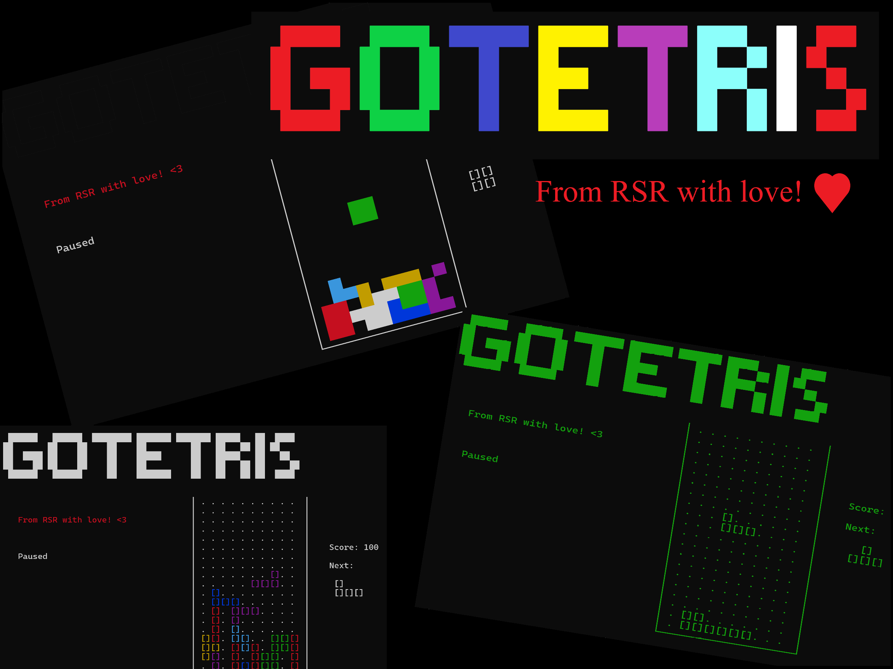

# 🎮 GoTetris: A Terminal-Based Tetris Game 🧩

Welcome to **GoTetris**, a fun and nostalgic Tetris game built entirely in Go! 🚀 This project brings the classic block-stacking puzzle game to your terminal, complete with customizable settings, colorful visuals, and optional sound effects. 🎵

---



---

## ✨ Features

- 🕹️ **Classic Tetris Gameplay**: Relive the timeless fun of Tetris in your terminal.
- 🎨 **Customizable Visuals**: Choose between 4 unique print modes:
  - **Background Color Mode**: Blocks are displayed with colorful backgrounds.
  - **Foreground Color Mode**: Blocks are displayed with colorful text.
  - **No Color Mode**: A minimalist, text-only experience.
  - **Electronika 60 Mode**: A nostalgic green-on-black theme inspired by the original Electronika 60 Tetris.
- 🎵 **Sound Effects**: Enable or disable sound effects and background music.
- 🏆 **High Score System**: Track your highest scores and compete with yourself!
- ⌨️ **Keyboard Controls**:
  - **Arrow Keys or WASD**: Move blocks left, right, or down.
  - **'UP key' or 'w'**: Rotate the current piece.
  - **Space**: Hard Drop (instantly drop the piece to the bottom).
  - **'p'**: Pause the game.
  - **'q' or ESC**: Quit the game.
- 🔄 **Endless Mode**: Play at a steady pace without increasing speed for a relaxed experience.
- 🚀 **Marathon Mode**: Play until the board fills up, with increasing speed as you clear more lines.


---

## 🚀 Getting Started

### Prerequisites
- Go 1.24.2 or higher installed on your system.
- ALSA development package (Linux only - install with "apt/dnf install libasound2-dev")

### Installation
1. Clone the repository:
```bash
git clone https://github.com/yourusername/gotetris.git
cd gotetris
```

2. Build the project
```bash
go build -o gotetris
```

3. Run the game
```bash
./gotetris start
```

---

## 🎮 How to Play
1. Start the game:
```bash
./gotetris start
```
2. Use the following controls to play:

* Arrow Keys or WASD: Move the blocks left, right, or down.
* 'UP key' or 'w': Rotate the current block.
* 'p': Pause the game.
* Space" Hard Drop.
* 'q' or ESC: Quit the game.

3. Stack the blocks to clear lines and score points! 🏆

---

## ⚙️ Command-Line Options
Customize your game experience with the following flags:

Flag |	Description	Default
-----|----------------------------------------------------------------------------
-p, --printmode	| Set the print mode: (1)background, (2)foreground, (3)nocolor or (60)electronika 60 | nocolor
-s, --sound	| Enable or disable sound effects |	false
-e, --endless | Enable Endless Mode (relaxed gameplay without increasing speed). | false

Example:
```bash
./gotetris start -p=60 -s -e
```

---

## 🏆 High Score System
* Your highest scores are saved locally in score.txt.
* Compete with yourself and try to beat your best score!
* The top 5 scores are displayed on the welcome screen.


---

## 📂 Project Structure
* cmd/: Contains the Cobra CLI commands.
* internal/game/: Core game logic and rendering.
* internal/util/: Utility functions and constants.
* assets/: Sound files for background music and game over effects.

---

## 🛠️ Development
Dependencies
This project uses the following Go libraries:

* [Cobra](https://github.com/spf13/cobra) for CLI commands.
* [Beep](https://github.com/faiface/beep) for sound effects.
* [Keyboard](https://github.com/eiannone/keyboard) for keyboard input handling.

Run Locally
1. Install dependencies:
```bash
go mod tidy
```
2. Run the game:
```bash
go run .
```

---

## 🎉 Contributing
We welcome contributions! 🛠️ Feel free to open issues or submit pull requests to improve the game.

---

## 📜 License
This project is licensed under the MIT License. See the LICENSE file for details.

Music by [Melody Ayres-Griffiths](https://pixabay.com/users/melodyayresgriffiths-27269767/?utm_source=link-attribution&utm_medium=referral&utm_campaign=music&utm_content=148250) from [Pixabay](https://pixabay.com//?utm_source=link-attribution&utm_medium=referral&utm_campaign=music&utm_content=148250)

---

## ❤️ Acknowledgments
* Inspired by the classic Tetris game. 🎵
* Built with love using Go. 🐹
